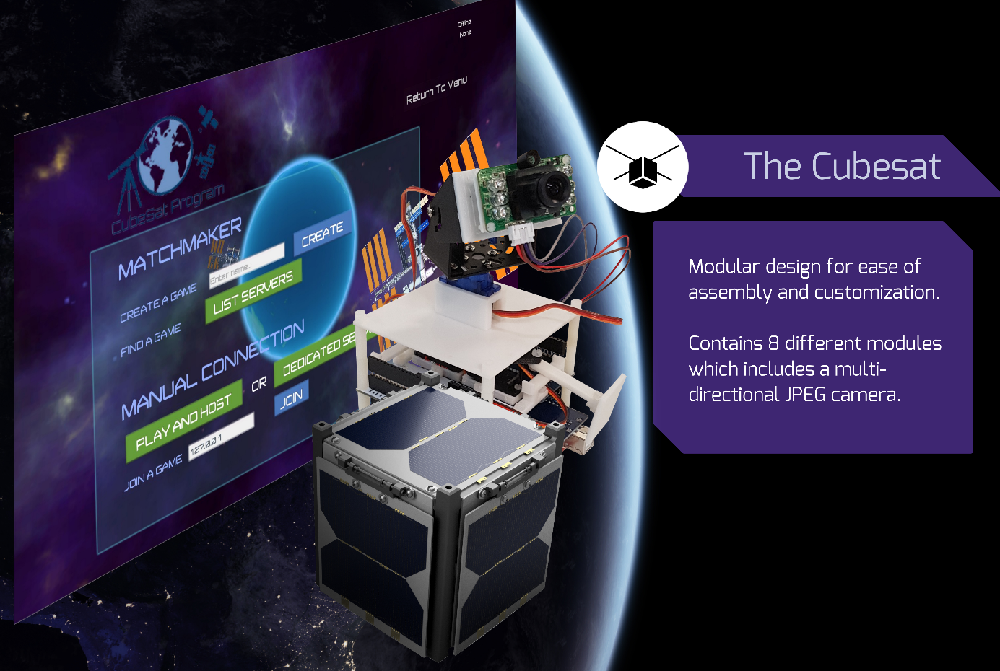

# CubeSat_comms

CubeSat_comms is the code backbone of CubeSat, developed using Arduino. It handles the sensor readings and movement control of CubeSat. It also maintains a two-way communication system between the CobeSat robot and the CubeSat gaming platform with bluetooth enabled. Commands that comes from the CubeSat Game will be sent to the CubeSat robot to perform corresponding actions.

## Cubesat_comms Firmware

## Setup
 - Arduino IDE is required ([Download Link](https://www.arduino.cc/en/Main/Software)).
 
## Contact
Feel free to contact me through pku1@jhu.edu if you have any questions.
